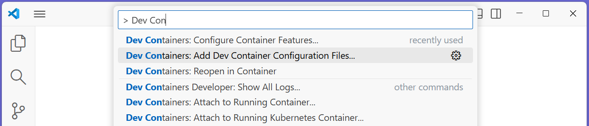
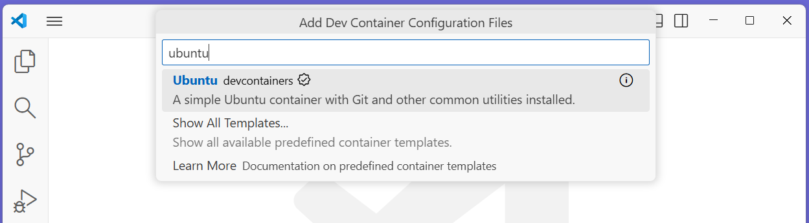
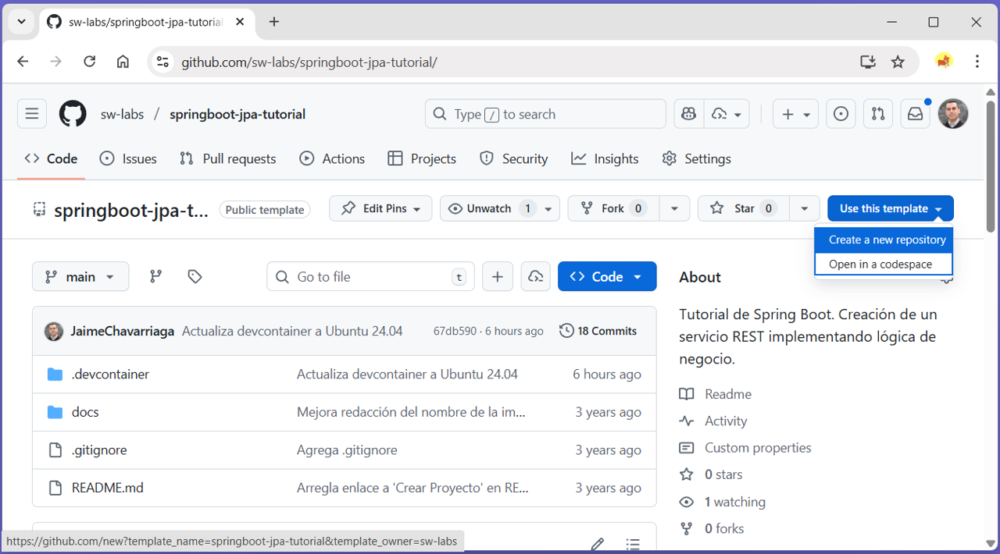
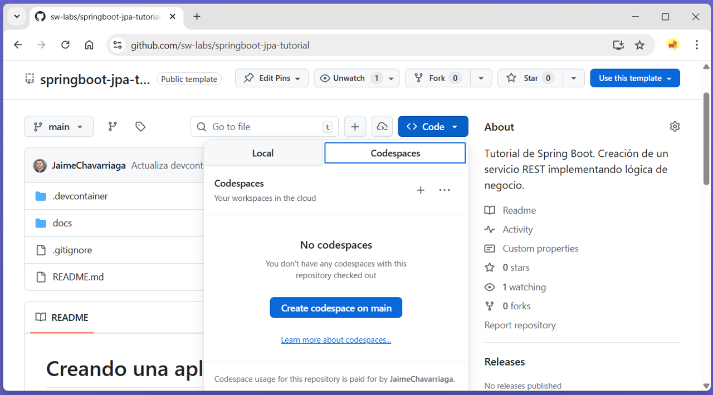
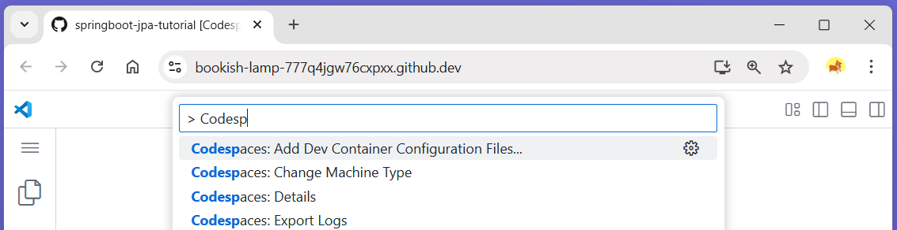

# Crear Ambiente de desarrollo

En Visual Studio Code, Github Codespaces y Gitpod es posible definir un ambiente de desarrollo para el proyecto basado en contenedores, usando una tecnología conocida como **devcontainers**, que será consistente para todos los desarrolladores del proyecto.

EL objetivo es que todos los desarrolladores cuenten con un mismo ambiente, las mismas librerías y extensiones, de forma que el proyecto funcione "igual" para todos. 

Hoy en día se pueden definir [Dev Containers](https://containers.dev/) en [Visual Studio Code](https://code.visualstudio.com/docs/devcontainers/containers) y [Github Codespaces](https://docs.github.com/en/codespaces/setting-up-your-project-for-codespaces/introduction-to-dev-containers).

- [Objetivo](#objetivo)
- [Crear un dev-container en Visual Studio Code](#crear-un-dev-container-en-visual-studio-code)
- [Crear un dev-container en Github Codespaces](#crear-un-dev-container-en-github-codespaces)

## Objetivo

En este paso crearemos un Dev Container para desarrollar aplicaciones Java con Spring Boot. 
En este contenedor incluiremos Java, Spring Boot CLI y Docker. 

> **NOTA:** En lugar de crear una imagen de Docker diferente para cada proyecto, se recomienda crear una imagen contenedor común. Para hacerlo, el sitio de Microsoft tiene una [guía para crear imágenes para varios proyectos](https://code.visualstudio.com/docs/devcontainers/devcontainer-cli#_prebuilding). 

---

## Especificación del Ambiente

El ambiente a crear tiene las siguientes características:

* Base: Ubuntu 24.04
* Features:
    * Java: `{version: latest, jdkDistro: ms, installMaven: true,mavenVersion: latest}`
    * Spring-Boot: `{version: latest, jdkVersion: none}`
    * Docker-in-docker: (valores por defecto)   

---

## Crear un dev-container en Visual Studio Code

1. (Si no lo ha hecho) Instale [Docker Desktop](https://www.docker.com/products/docker-desktop). 

2. (Si no lo ha hecho) Instale el complemento [`Remote Development Pack`](https://marketplace.visualstudio.com/items?itemName=ms-vscode-remote.vscode-remote-extensionpack&wt.mc_id=vscode-medium-brborges). 

3. Ppresione `[F1]` para que aparezca el menú de opciones y ejecute `Dev Containers: Add Dev Container Configuration Files...`. 

    

4. Seleccione el **tipo de Dev Container** como `Ubuntu`

    

    Indique la versión de Ubuntu: `ubuntu-20.04`.

    

5. Configure el **software adicional** y las opciones del Dev Container seleccionando:

    - **Features** (Características) adicionales: 
        - `Java`
        - `Spring Boot` 
        - `Docker (Docker-in-Docker)`

    Al terminar de ingresar las opciones, Visual Studio Code debe generar los archivos de configuración.

5. Presione `[F1]` y ejecute `Dev Containers: Reopen in Container` para iniciar el desarrollo en el Dev Container. 

## Crear un dev-container en Github Codespaces

1. Cree un nuevo repositorio a partir de la plantila del tutorial. En la página [https://github.com/sw-labs/springboot-jpa-tutorial/](https://github.com/sw-labs/springboot-jpa-tutorial/) seleccione el botón `Use this template` y seleccione `Create a new repository`. Ingrese la información del nuevo repositorio.

    

2. Cree un ambiente de **Codespace** en el repositorio que acaba de crear del proyecto. En la página del nuevo  repositorio seleccione el botón `Code` y seleccione `Crear un Codespaces`

    

5. (Si se necesitan opciones adiconales) presione `[F1]` para que aparezca el menú de opciones y ejecute `Codespaces: Add Dev Container Configuration Files...`. 

    

 

## 

**Siguiente:** [Crear proyecto Spring Boot](2.crear-proyecto.md)