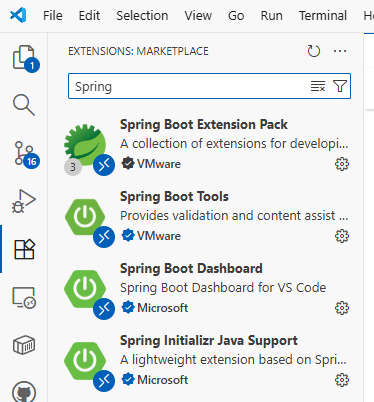
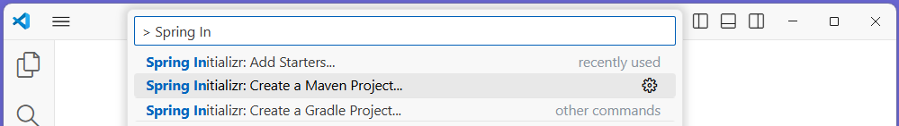
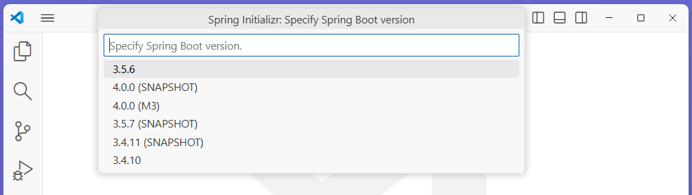
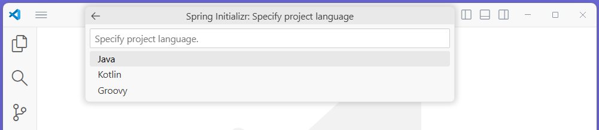
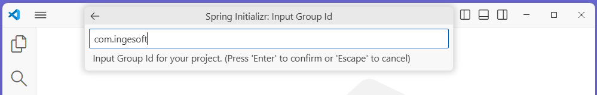
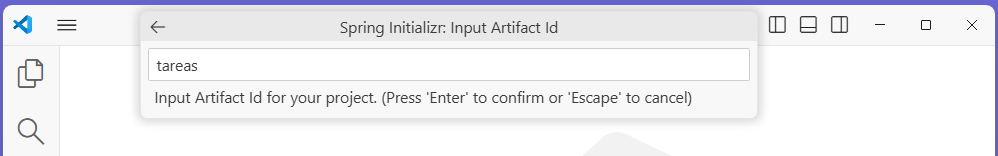
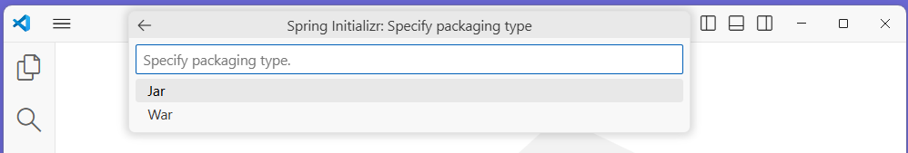
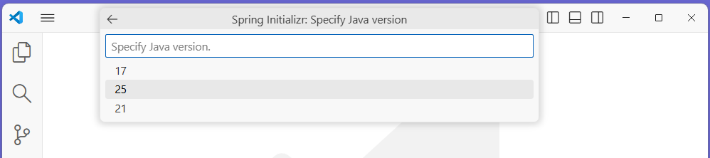
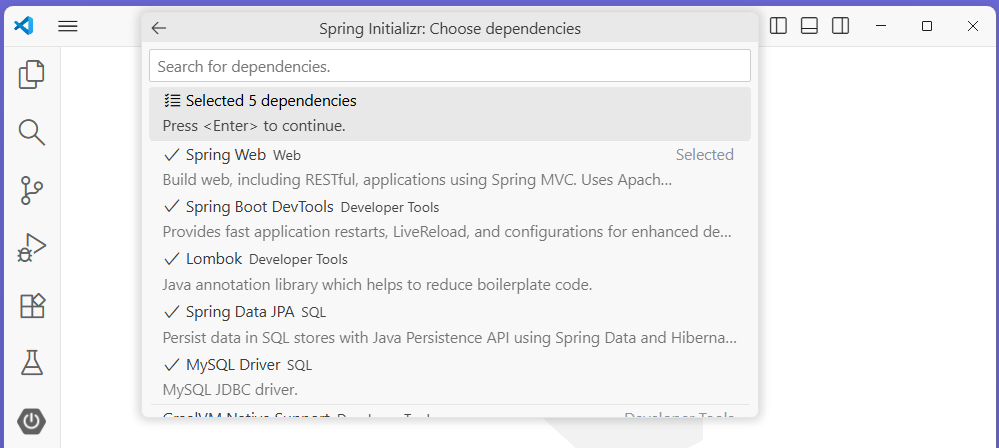
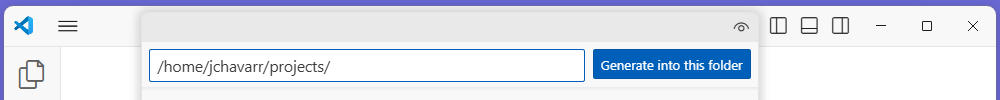

# Crear proyecto con Spring Boot

Los proyectos de Spring Boot se pueden crear usando la herramienta de Spring Boot Initializr

- [Objetivo](#objetivo)
- [Usando Spring Boot Initialzr](#usando-spring-boot-initialzr)

---

## Objetivo

En este paso crearemos un proyecto inicial basado en Spring Boot. 
Este proyecto incluirá soporte para el desarrollo de aplicaciones web, usando [Lombok](https://projectlombok.org/) para construir el programa con menos líneas de código, [Spring Data JPA](https://spring.io/projects/spring-data-jpa) para crear repositorios de objetos usando JPA y [drivers JDBC de MySQL](https://www.mysql.com/products/connector/) para conectarnos a bases de datos MySQL.

Estas instrucciones aplican para **Visual Studio Code** y **Github Codespaces**.

> **NOTA:** Esta página muestra los pasos para crear el proyecto usado la extensión de [Spring Boot Initialzr](https://marketplace.visualstudio.com/items?itemName=vscjava.vscode-spring-initializr). Si desea usar otras opciones, puede ver las instrucciones para [Crear proyecto Spring Boot con otras herramientas](2.crear-proyecto-otros.md)

---

## Usando Spring Boot Initialzr

1. (Si no lo ha hecho) Instale la extensión de [Spring Boot Initialzr](https://marketplace.visualstudio.com/items?itemName=vscjava.vscode-spring-initializr) por medio del [Spring Boot Extension Pack](https://marketplace.visualstudio.com/items?itemName=vmware.vscode-boot-dev-pack).

    Seleccione la vista de `Extensiones`, haciendo click en el ícono  o presionando `Ctrl+Shift+X` en Windows/Linux, o `Cmd+Shift+X` en macOS.

    En el panel de Extensiones, busque las extensiones de `Spring` e instale `Spring Boot Extension Pack`
    
      

2. Cree el proyecto, usando el comando `> Spring Initializr: Create a Mven Project...`

      

3. Seleccione la versión de Spring Boot, seleccione `3.5.6`, o la más reciente.

      

4. Seleccione el lenguaje `Java`

      

5. Seleccione el nombre del grupo `com.ingesoft`

      

6. Seleccione el nombre del proyecto `tareas`

      

7. Seleccione el tipo de empaquetado de la aplicación `jar`

      

8. Seleccione la version de Java `25`

      

9. Seleccione las dependencias (las librerías a utilizar), `Spring Web`, `Spring Boot DevTools`, `Lombok`, `Spring Data JPA` y `MySQL`.

      

10. Verifique el nombre de la carpeta y haga clic en el botón `Generate into this folder`

      

 

## 

Siguiente: [Ejecutar MySQL](3.ejecutar-mysql.md)